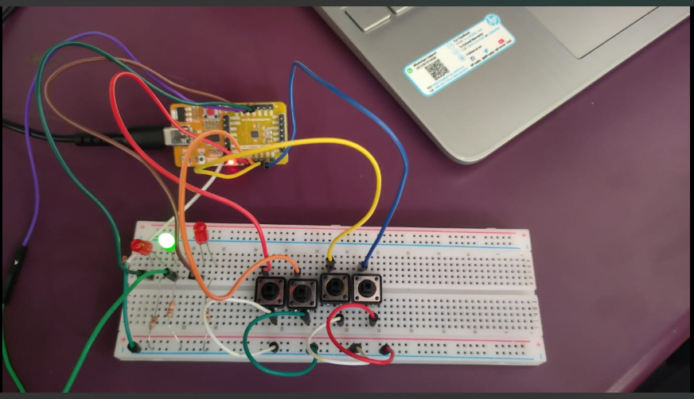

# 2-Bit Comparator using VSDSquadron Mini

## Overview
This project implements a **2-bit comparator** using the **VSDSquadron Mini** board. It compares two 2-bit binary numbers (A and B) and determines whether:  
- **A > B**  
- **A = B**  
- **A < B**  

The result is displayed using **three LEDs**.

## Components Used
- **VSDSquadron Mini Board**
- **4 push buttons** (for inputs: A1, A0, B1, B0)
- **3 LEDs** (for output indicators: A > B, A = B, A < B)
- **1kΩ Resistors** (for LEDs)
- **Breadboard & Jumper Wires**

## Pin Configuration
| Function | Pin |
|----------|----|
| A1 (Input) | PD0 |
| A0 (Input) | PD1 |
| B1 (Input) | PD2 |
| B0 (Input) | PD3 |
| A > B (LED) | PC4 |
| A = B (LED) | PC5 |
| A < B (LED) | PC6 |

-----

## How It Works
1. The push buttons allow users to set 2-bit values for A and B.
2. The program reads the input and determines the comparison result.
3. The corresponding LED lights up for **A > B**, **A = B**, or **A < B**.

------
## Truth Table
| **A1** | **A0** | **B1** | **B0** | **A > B (PC4 LED )** | **A = B (PC5 LED )** | **A < B (PC6 LED ** |
|:------:|:------:|:------:|:------:|:----------------------:|:----------------------:|:----------------------:|
| 0 | 0 | 0 | 0 | 0 | 1 | 0 |
| 0 | 0 | 0 | 1 | 0 | 0 | 1 |
| 0 | 0 | 1 | 0 | 0 | 0 | 1 |
| 0 | 0 | 1 | 1 | 0 | 0 | 1 |
| 0 | 1 | 0 | 0 | 1 | 0 | 0 |
| 0 | 1 | 0 | 1 | 0 | 1 | 0 |
| 0 | 1 | 1 | 0 | 0 | 0 | 1 |
| 0 | 1 | 1 | 1 | 0 | 0 | 1 |
| 1 | 0 | 0 | 0 | 1 | 0 | 0 |
| 1 | 0 | 0 | 1 | 1 | 0 | 0 |
| 1 | 0 | 1 | 0 | 0 | 1 | 0 |
| 1 | 0 | 1 | 1 | 0 | 0 | 1 |
| 1 | 1 | 0 | 0 | 1 | 0 | 0 |
| 1 | 1 | 0 | 1 | 1 | 0 | 0 |
| 1 | 1 | 1 | 0 | 1 | 0 | 0 |
| 1 | 1 | 1 | 1 | 0 | 1 | 0 |

------
## PROGRAM

    #include <ch32v00x.h>
    #include <debug.h>

    // Define input pins for push buttons (PD1, PD2 for A; PD3, PD4 for B)
    #define A0_PIN GPIO_Pin_1
    #define A1_PIN GPIO_Pin_2
    #define B0_PIN GPIO_Pin_3
    #define B1_PIN GPIO_Pin_4

    // Define output pins for LEDs (PC3 for A < B, PC4 for A == B, PC5 for A > B)
    #define LT_PIN GPIO_Pin_3  // Red LED (A < B)
    #define EQ_PIN GPIO_Pin_4  // Green LED (A == B)
    #define GT_PIN GPIO_Pin_5  // Yellow LED (A > B)

    void GPIO_Config(void) {
    GPIO_InitTypeDef GPIO_InitStructure;

    // Enable GPIO clocks for port D and port C
    RCC_APB2PeriphClockCmd(RCC_APB2Periph_GPIOD, ENABLE);
    RCC_APB2PeriphClockCmd(RCC_APB2Periph_GPIOC, ENABLE);

    // Configure push button input pins (PD1, PD2, PD3, PD4)
    GPIO_InitStructure.GPIO_Pin = A0_PIN | A1_PIN | B0_PIN | B1_PIN;
    GPIO_InitStructure.GPIO_Mode = GPIO_Mode_IPU;  // Internal pull-up
    GPIO_Init(GPIOD, &GPIO_InitStructure);

    // Configure LED output pins (PC3, PC4, PC5)
    GPIO_InitStructure.GPIO_Pin = LT_PIN | EQ_PIN | GT_PIN;
    GPIO_InitStructure.GPIO_Mode = GPIO_Mode_Out_PP;
    GPIO_InitStructure.GPIO_Speed = GPIO_Speed_50MHz;
    GPIO_Init(GPIOC, &GPIO_InitStructure);
    }

    void CompareNumbers(void) {
    uint8_t A = ((GPIO_ReadInputDataBit(GPIOD, A1_PIN) << 1) | GPIO_ReadInputDataBit(GPIOD, A0_PIN));
    uint8_t B = ((GPIO_ReadInputDataBit(GPIOD, B1_PIN) << 1) | GPIO_ReadInputDataBit(GPIOD, B0_PIN));

    // Reset all LEDs
    GPIO_ResetBits(GPIOC, LT_PIN | EQ_PIN | GT_PIN);

    // Comparison logic
    if (A > B) {
        GPIO_SetBits(GPIOC, GT_PIN);  // Yellow LED (A > B)
    } else if (A == B) {
        GPIO_SetBits(GPIOC, EQ_PIN);  // Green LED (A == B)
    } else {
        GPIO_SetBits(GPIOC, LT_PIN);  // Red LED (A < B)
    }
    }

    int main(void) {
    // Initialize the system and GPIO
    NVIC_PriorityGroupConfig(NVIC_PriorityGroup_2);
    SystemCoreClockUpdate();
    Delay_Init();
    GPIO_Config();

    while (1) {
        CompareNumbers();
        Delay_Ms(100);  // Debouncing delay
        
-----
## IMAGE 1

## IMAGE 2

[VIDEO LINK (2 BIT COMPARATOR)](https://drive.google.com/file/d/1PHe6CMQpSTCm5ZwkPLy9mVXqagr21bq6/view?usp=drive_link)
