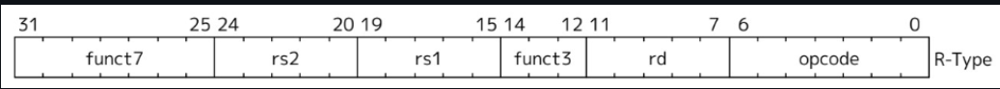
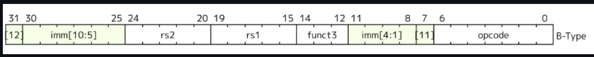
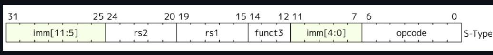
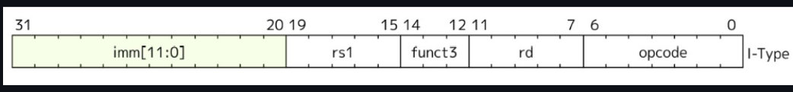
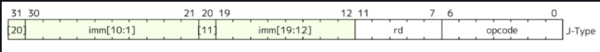
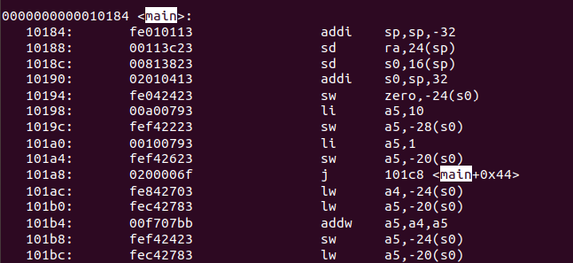

# Decoding RISC-V Instructions: A Visual Guide

---

---

#### Instruction Types and Fields
RISC-V instructions are categorized as:
- *R-type*: Register type
- *I-type*: Immediate type
- *S-type*: Store type
- *B-type*: Branch type
- *U-type*: Upper immediate type
- *J-type*: Jump type

#### Opcode and Function Fields
- *Opcode*: Determines the type of instruction.
- *func3 and func7*: Specify operations within an instruction type.

---
### R type 

**Binary Fields**:
- `opcode`: `0110011`
- `funct7`: `0000000`
- `funct3`: `000`
- `rs1`: `01000` (x2)
- `rs2`: `01001` (x3)
- `rd`: `00001` (x1)

**32-bit Instruction**:  
`0000000 01001 01000 000 00001 0110011`
### B type

**Binary Fields**:
- `opcode`: `1100011`
- `funct3`: `000`
- `rs1`: `00001` (x1)
- `rs2`: `01000` (x2)
- `imm`: `111111111100` (split into `imm[12|10:5|4:1|11]`)

**32-bit Instruction**:  
`1111111 01000 00001 000 11110 1100011`
### S type

**Binary Fields**:
- `opcode`: `0100011`
- `funct3`: `010`
- `rs1`: `01000` (x2)
- `rs2`: `01001` (x3)
- `imm`: `000000000100` (split into `imm[11:5] = 0000000` and `imm[4:0] = 0100`)

**32-bit Instruction**:  
`0000000 01001 01000 010 00001 0100011`
### I type

**Binary Fields**:
- `opcode`: `0010011`
- `funct3`: `000`
- `rs1`: `01000` (x2)
- `rd`: `00001` (x1)
- `imm`: `0000000000000101`

**32-bit Instruction**:  
`000000000101 01000 000 00001 0010011`
### U type

**Binary Fields**:
- `opcode`: `0110111`
- `rd`: `00001` (x1)
- `imm`: `00000000000100000000` (upper 20 bits)

**32-bit Instruction**:  
`000000000001 00000000 000 00001 0110111`
### j type 

**Binary Fields**:
- `opcode`: `1101111`
- `rd`: `00001` (x1)
- `imm`: `0000000000000000000000001100100` (target address, 21 bits)

**32-bit Instruction**:  
`0000000000000000000000001100100 00001 1101111`

---

### MACHINE CODE FOR EACH INSTRUCTIONS

