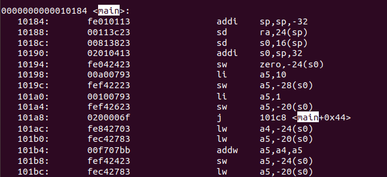

# Decoding RISC-V Instructions: A Visual Guide

---

---

#### Instruction Types and Fields
RISC-V instructions are categorized as:
- *R-type*: Register type
- *I-type*: Immediate type
- *S-type*: Store type
- *B-type*: Branch type
- *U-type*: Upper immediate type
- *J-type*: Jump type

#### Opcode and Function Fields
- *Opcode*: Determines the type of instruction.
- *func3 and func7*: Specify operations within an instruction type.

---
### R type 

**Binary Fields**:
- `opcode`: `0110011`
- `funct7`: `0000000`
- `funct3`: `000`
- `rs1`: `01000` (x2)
- `rs2`: `01001` (x3)
- `rd`: `00001` (x1)

**32-bit Instruction**:  
`0000000 01001 01000 000 00001 0110011`
### B type

**Binary Fields**:
- `opcode`: `1100011`
- `funct3`: `000`
- `rs1`: `00001` (x1)
- `rs2`: `01000` (x2)
- `imm`: `111111111100` (split into `imm[12|10:5|4:1|11]`)

**32-bit Instruction**:  
`1111111 01000 00001 000 11110 1100011`
### S type

**Binary Fields**:
- `opcode`: `0100011`
- `funct3`: `010`
- `rs1`: `01000` (x2)
- `rs2`: `01001` (x3)
- `imm`: `000000000100` (split into `imm[11:5] = 0000000` and `imm[4:0] = 0100`)

**32-bit Instruction**:  
`0000000 01001 01000 010 00001 0100011`
### I type

**Binary Fields**:
- `opcode`: `0010011`
- `funct3`: `000`
- `rs1`: `01000` (x2)
- `rd`: `00001` (x1)
- `imm`: `0000000000000101`

**32-bit Instruction**:  
`000000000101 01000 000 00001 0010011`
### U type

**Binary Fields**:
- `opcode`: `0110111`
- `rd`: `00001` (x1)
- `imm`: `00000000000100000000` (upper 20 bits)

**32-bit Instruction**:  
`000000000001 00000000 000 00001 0110111`
### j type 

**Binary Fields**:
- `opcode`: `1101111`
- `rd`: `00001` (x1)
- `imm`: `0000000000000000000000001100100` (target address, 21 bits)

**32-bit Instruction**:  
`0000000000000000000000001100100 00001 1101111`

---

### MACHINE CODE FOR EACH INSTRUCTIONS

### 1. **I-Type: addi sp, sp, -32**

*Description*: Adds the immediate value   `-32 `to the contents of `sp (x2)`, storing the result back in `sp (x2)`.

*Binary Fields*:
- opcode: `0010011` (for addi)
- funct3:` 000` (for addi)
- rd: `00010` (sp = x2)
- rs1:` 00010 `(sp = x2)
- imm: `111111111000` (12-bit immediate = -32)

*32-bit Instruction*:  
`111111111000 00010 000 00010 0010011`

*Hex*: 
`fe010113`

----

### 2. **S-Type: sd ra, 24(sp)**

*Description*: Stores the value from register `ra` (x1) at the address calculated by adding the immediate value `24` to the value in register `sp` (x2).

#### Binary Fields:
- **opcode**: `0100011` (for `sd` - store doubleword)
- **funct3**: `011` (for `sd`)
- **rs1**: `00010` (sp = x2)
- **rs2**: `00001` (ra = x1)
- **imm[11:5]**: `0000000` (upper 7 bits of immediate = 0)
- **imm[4:0]**: `11000` (lower 5 bits of immediate = 24)

#### 32-bit Instruction:  
`0000000 00001 00010 011 11000 0100011`

#### Hex:  
`0x00113c32`

---

### 3. **S-Type: sd s0, 16(sp)**

*Description*: Stores the value from register `s0` (x8) at the address calculated by adding the immediate value `16` to the value in register `sp` (x2).

#### Binary Fields:
- **opcode**: `0100011` (for `sd` - store doubleword)
- **funct3**: `011` (for `sd`)
- **rs1**: `00010` (sp = x2)
- **rs2**: `01000` (s0 = x8)
- **imm[11:5]**: `0000000` (upper 7 bits of immediate = 0)
- **imm[4:0]**: `10000` (lower 5 bits of immediate = 16)

#### 32-bit Instruction:  
`0000000 01000 00010 011 10000 0100011`

#### Hex:  
`0x00813823`

---

### 4. **I-Type: addi s0, sp, 32**

*Description*: Adds the immediate value `32` to the contents of `sp` (x2), storing the result back in register `s0` (x8).

#### Binary Fields:
- **opcode**: `0010011` (for `addi` - add immediate)
- **funct3**: `000` (for `addi`)
- **rd**: `01000` (s0 = x8)
- **rs1**: `00010` (sp = x2)
- **imm[11:0]**: `000000100000` (12-bit immediate = 32)

#### 32-bit Instruction:  
`000000100000 00010 000 01000 0010011`

#### Hex:  
`0x02010413`

---

### 5. **S-Type: sw zero, -24(s0)**

*Description*: Stores the value from register `zero` (x0) at the address calculated by adding the immediate value `-24` to the value in register `s0` (x8).

#### Binary Fields:
- **opcode**: `0100011` (for `sw` - store word)
- **funct3**: `010` (for `sw`)
- **rs1**: `01000` (s0 = x8)
- **rs2**: `00000` (zero = x0)
- **imm[11:5]**: `1111111` (upper 7 bits of immediate = -24)
- **imm[4:0]**: `00100` (lower 5 bits of immediate = -24)

#### 32-bit Instruction:  
`1111111 00000 01000 010 00100 0100011`

#### Hex:  
`0xfe042423`

---

### 6. **I-Type: addi a5, s0, -28**

*Description*: Adds the immediate value `-28` to the contents of register `s0` (x8), storing the result back in register `a5` (x15).

#### Binary Fields:
- **opcode**: `0010011` (for `addi` - add immediate)
- **funct3**: `000` (for `addi`)
- **rd**: `01111` (a5 = x15)
- **rs1**: `01000` (s0 = x8)
- **imm[11:0]**: `111111001100` (12-bit immediate = -28)

#### 32-bit Instruction:  
`111111001100 01000 000 01111 0010011`

#### Hex:  
`0x00a00793`

---

### 7. **S-Type: sw a5, -28(s0)**

*Description*: Stores the contents of register `a5` (x15) into memory at the address calculated by adding `-28` to the contents of register `s0` (x8).

#### Binary Fields:
- **opcode**: `0100011` (for `sw` - store word)
- **funct3**: `010` (for `sw`)
- **rs2**: `01111` (a5 = x15)
- **rs1**: `01000` (s0 = x8)
- **imm[11:0]**: `111111001100` (12-bit immediate = -28)

#### SPLIT Immediate:
- **imm[11:5]**: `1111111` (upper 7 bits of the immediate)
- **imm[4:0]**: `00100` (lower 5 bits of the immediate)

#### 32-bit Instruction:  
`1111111 01111 01000 010 00100 0100011`

#### Hex:  
`0xfef42223`

---

### 8. **I-Type: li a5, 1**

*Description*: Loads the immediate value `1` into register `a5` (x15) by adding it to the value in register `x0` (which always holds `0`).

#### Binary Fields:
- **opcode**: `0010011` (for `addi` - add immediate)
- **funct3**: `000` (for `addi`)
- **rd**: `01111` (a5 = x15)
- **rs1**: `00000` (x0 = zero register)
- **imm[11:0]**: `000000000001` (12-bit immediate = 1)

#### 32-bit Instruction:  
`000000000001 00000 000 01111 0010011`

#### Hex:  
`0x00100793`

---

### 9. **S-Type: sw a5, -20(s0)**

*Description*: Stores the value from register `a5` (x15) into the memory address calculated as `-20 + s0` (where `s0` is x8).

#### Binary Fields:
- **imm[11:5]**: `1111111` (higher 7 bits of -20 in 12-bit binary)
- **rs2**: `01111` (a5 = x15)
- **rs1**: `01000` (s0 = x8)
- **funct3**: `010` (for `sw`)
- **imm[4:0]**: `11100` (lower 5 bits of -20 in 12-bit binary)
- **opcode**: `0100011` (for store instructions)

#### 32-bit Instruction:  
`1111111 01111 01000 010 11100 0100011`

#### Hex:  
`0xFE742623`

---

### 10. **J-Type: j 101c8<main+0*44>**

*Description*: Jump to the address `101c8 + (main + 0 * 44)`.

#### Binary Fields:
- **imm[20]**: `0` (most significant bit of the 20-bit immediate)
- **imm[10:1]**: `0000000000` (middle 10 bits of the immediate value 0x20)
- **imm[11]**: `0` (the 11th bit of the immediate value)
- **imm[19:12]**: `00000000` (last 8 bits of the immediate)
- **rd**: `00000` (rd is not used in J-Type instructions)
- **opcode**: `1101111` (opcode for the `j` instruction)

#### 32-bit Instruction:  
`0 0000000000 0 00000000 00000 1101111`

#### Hex:  
`0x0200006F`

---

### 11. I-Type: lw a4, -24(s0)

*Description*: Loads a word from memory at the address `(s0 + -24)`, storing the result into register a4 (x10).

*Binary Fields*:
- imm[11:0]: `111111111100` (binary for -24)
- rs1: `01000` (s0 = x8)
- funct3: `010` (for lw)
- rd: `01010` (a4 = x10)
- opcode: `0000011` (for load instructions)

*32-bit Instruction*:  
`111111111100 01000 010 01010 0000011`

*Hex*:  
`fe842703`

---

### 12. I-Type: lw a5, -20(s0)

*Description*: Loads a word from memory at the address `(s0 + -20)`, storing the result into register a5 (x15).

*Binary Fields*:
- imm[11:0]: `111111111100` (binary for -20)
- rs1: `01000` (s0 = x8)
- funct3:` 010 `(for lw)
- rd: `01111` (a5 = x15)
- opcode: `0000011` (for load instructions)

*32-bit Instruction*:  
`111111111100 01000 010 01111 0000011`

*Hex*:  
`fec42783`

---

###  13. R-Type: addw a5, a4, a5

*Description*: Performs the addition of the values in registers` a4 (x10)` and `a5 (x15)`, and stores the result in register `a5 (x15)`.

*Binary Fields*:
- funct7:` 0000000 `(for addw)
- rs2:` 01111 `(a5 = x15)
- rs1:` 01010` (a4 = x10)
- funct3:` 000 `(for addw)
- rd:` 01111 `(a5 = x15)
- opcode:` 0110011 `(for arithmetic operations)

*32-bit Instruction*:  
`0000000 01111 01010 000 01111 0110011`

*Hex*:  
`00f707bb`

---

### 14. S-Type: sw a5, -24(s0)

*Description*: Stores the value in register` a5 (x15)` at the memory address computed by adding `-24 `to the value in register `s0 (x8`).

*Binary Fields*:
- imm[11:5]: `1111111` (upper 7 bits of -24)
- rs2:` 01111` (a5 = x15)
- rs1: `01000 `(s0 = x8)
- funct3:` 010` (for sw)
- imm[4:0]: `11100 `(lower 5 bits of -24)
- opcode:` 0100011 `(for store instructions)

*32-bit Instruction*:  
`1111111 01111 01000 010 11100 0100011`

*Hex*:  
`0xfef42423`

---

### 15. I-Type: lw a5, -20(s0)

*Description*: Loads the word from the memory address computed by adding `-20` to the value in register `s0 (x8)` into register` a5 (x15)`.

*Binary Fields*:
- imm[11:0]: `111111111100` (12-bit two's complement of -20)
- rs1:` 01000 `(s0 = x8)
- funct3: `010` (for lw)
- rd:` 01111` (a5 = x15)
- opcode: `0000011 `(for load instructions)

*32-bit Instruction*:  
`111111111100 01000 010 01111 0000011`

*Hex*:  
`0xFEC42783`

