# The output waveform

-The output waveform showing the instructions performed in a 5-stage pipelined architecture

-instruction 1 : addi

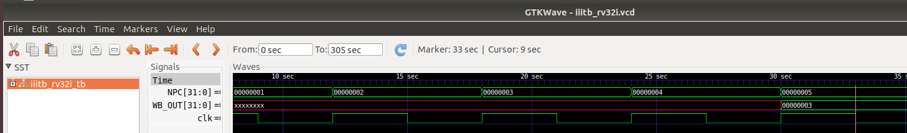

-instruction 2 : sd

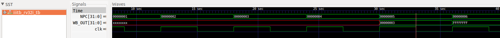

-instruction 3 : sd

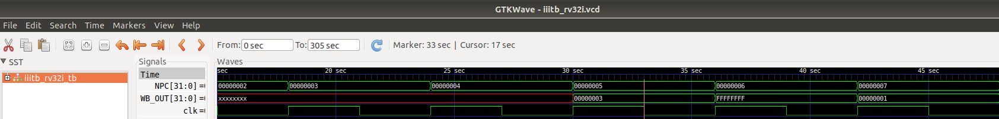

-instruction 4 : addi

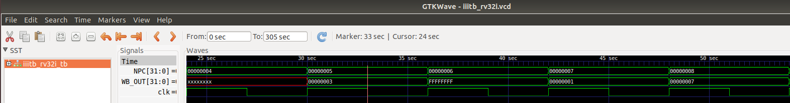

-instruction 5 : li

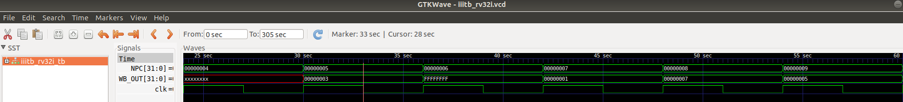

-instruction 6 : sw

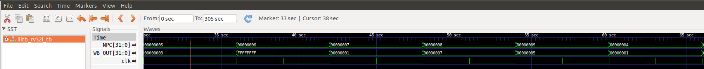

-instruction 7 : lui

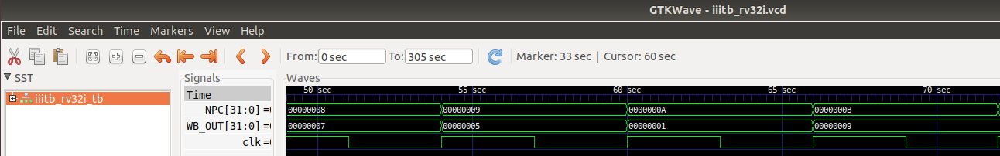

-instruction 8 : addi

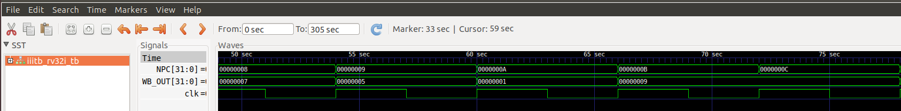

-instruction 9 : jal

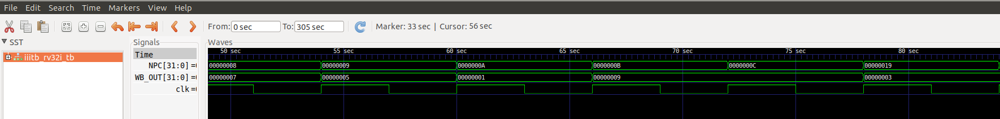

-instruction 10 : li

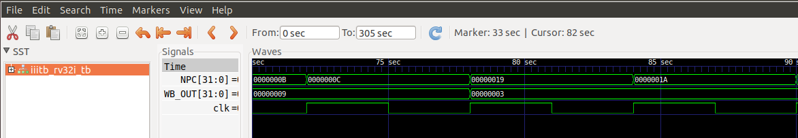

-instruction 11 : sw

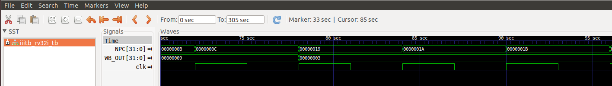

-instruction 12 : j

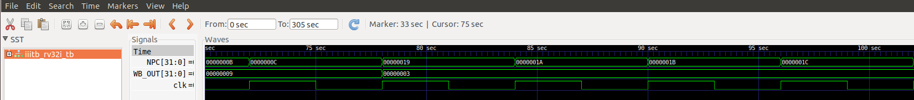

---

-Full 5-stage instruction pipeline and pc-increment description Waveform

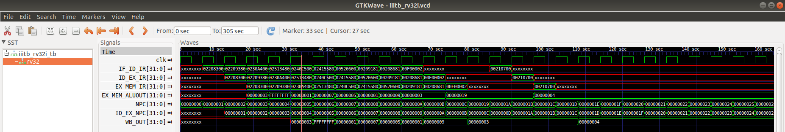

