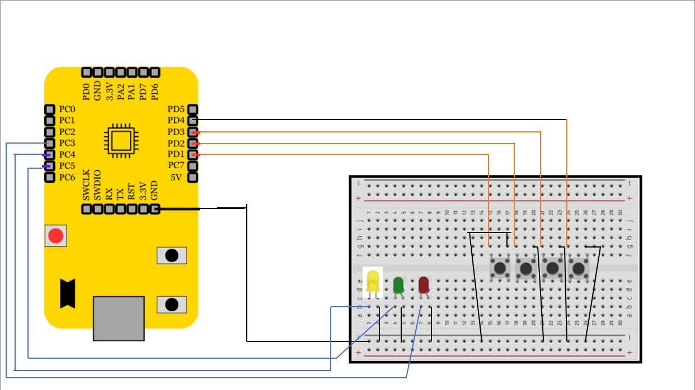

# 2-Bit Comparator using VSDSquadron Mini

## Overview
This project involves implementing a **2-bit comparator circuit** using the VSDSquadron Mini RISC-V development board. A 2-bit comparator compares two binary numbers (`A[1:0]` and `B[1:0]`) and outputs:
1. **A > B (Green LED)**: Indicates that `A` is greater than `B`.
2. **A == B (Yellow LED)**: Indicates that `A` is equal to `B`.
3. **A < B (Red LED)**: Indicates that `A` is less than `B`.

This project showcases the practical application of digital logic and RISC-V GPIO programming using the PlatformIO IDE.

---

## Components Required
- **VSDSquadron Mini Board**.
- **4 Push Buttons** (2 for `A[1:0]` and 2 for `B[1:0]`).
- **3 LEDs** (Green, Yellow, Red).
- **Breadboard**.
- **Jumper Wires**.
- **VS Code** and **PlatformIO IDE**.

---

## Logical Diagram and Expressions
The comparator logic uses Boolean algebra to determine the three outputs:

1. **A > B**:  
   \( G = A_1B_1' + (A_1 \cdot B_1)(A_0B_0') \)

2. **A == B**:  
   \( E = (A_1 \oplus B_1)' \cdot (A_0 \oplus B_0)' \)

3. **A < B**:  
   \( S = A_1'B_1 + (A_1 \cdot B_1)(A_0'B_0) \)

---

## Hardware Connections

| **Signal**     | **GPIO Pin** | **Connection**       |
|-----------------|--------------|----------------------|
| **A[1]**       | PD1          | Push Button Input    |
| **A[0]**       | PD2          | Push Button Input    |
| **B[1]**       | PD3          | Push Button Input    |
| **B[0]**       | PD4          | Push Button Input    |
| **A > B (G)**  | PC4          | Green LED Output     |
| **A == B (E)** | PC5          | Yellow LED Output    |
| **A < B (S)**  | PC6          | Red LED Output       |
| **VCC**        | 3.3V         | Power Supply         |
| **GND**        | GND          | Ground               |

---


---

## Truth Table to Verify the 2-Bit Comparator

| **A[1]** | **A[0]** | **B[1]** | **B[0]** | **A > B (G)** | **A == B (E)** | **A < B (S)** |
|----------|----------|----------|----------|---------------|----------------|---------------|
| 0        | 0        | 0        | 0        | 0             | 1              | 0             |
| 0        | 1        | 0        | 0        | 1             | 0              | 0             |
| 1        | 0        | 0        | 1        | 1             | 0              | 0             |
| 1        | 1        | 0        | 0        | 1             | 0              | 0             |
| 1        | 1        | 1        | 1        | 0             | 1              | 0             |
| 0        | 1        | 1        | 0        | 0             | 0              | 1             |
| 0        | 0        | 1        | 1        | 0             | 0              | 1             |

---

## HOW TO PROGRAM

```c
#include <stdio.h>
#include <ch32v00x.h>

// Logic Gate Functions
int and(int a, int b) { return a & b; }
int or(int a, int b) { return a | b; }
int xor(int a, int b) { return a ^ b; }
int not(int a) { return ~a & 1; }

// GPIO Configuration
void GPIO_Config(void) {
    GPIO_InitTypeDef GPIO_InitStructure = {0};
    RCC_APB2PeriphClockCmd(RCC_APB2Periph_GPIOD, ENABLE);
    RCC_APB2PeriphClockCmd(RCC_APB2Periph_GPIOC, ENABLE);

    // Inputs: A[1:0], B[1:0]
    GPIO_InitStructure.GPIO_Pin = GPIO_Pin_1 | GPIO_Pin_2 | GPIO_Pin_3 | GPIO_Pin_4;
    GPIO_InitStructure.GPIO_Mode = GPIO_Mode_IPU;
    GPIO_Init(GPIOD, &GPIO_InitStructure);

    // Outputs: G, E, S
    GPIO_InitStructure.GPIO_Pin = GPIO_Pin_4 | GPIO_Pin_5 | GPIO_Pin_6;
    GPIO_InitStructure.GPIO_Mode = GPIO_Mode_Out_PP;
    GPIO_Init(GPIOC, &GPIO_InitStructure);
}

int main() {
    uint8_t A[2], B[2], G, E, S;

    SystemCoreClockUpdate();
    Delay_Init();
    GPIO_Config();

    while (1) {
        // Read 2-bit inputs A and B
        A[1] = GPIO_ReadInputDataBit(GPIOD, GPIO_Pin_1);
        A[0] = GPIO_ReadInputDataBit(GPIOD, GPIO_Pin_2);
        B[1] = GPIO_ReadInputDataBit(GPIOD, GPIO_Pin_3);
        B[0] = GPIO_ReadInputDataBit(GPIOD, GPIO_Pin_4);

        // Comparator Logic
        G = (and(A[1], not(B[1]))) | (and(not(xor(A[1], B[1])), and(A[0], not(B[0]))));
        E = not(xor(A[1], B[1])) & not(xor(A[0], B[0]));
        S = (and(not(A[1]), B[1])) | (and(not(xor(A[1], B[1])), and(not(A[0]), B[0])));

        // Output Results
        GPIO_WriteBit(GPIOC, GPIO_Pin_4, G ? RESET : SET); // Green LED for A > B
        GPIO_WriteBit(GPIOC, GPIO_Pin_5, E ? RESET : SET); // Yellow LED for A == B
        GPIO_WriteBit(GPIOC, GPIO_Pin_6, S ? RESET : SET); // Red LED for A < B
    }
}

